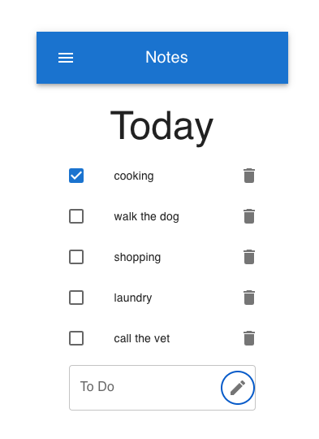

# Notes
## Simple To-Do List Mobile App
This is a simple mobile application that allows users to create and manage to-do lists on their mobile devices. The app utilizes local storage to persist all data, ensuring that tasks remain saved even when the user closes the app.

## Features:
- Create Tasks: Users can easily create new tasks by typing them into the app.
- Manage Tasks: Tasks can be marked as completed or deleted as needed.
- Local Storage: All tasks are stored locally on the device, ensuring data persistence across app sessions.
- Simple Interface: The app features a clean and intuitive interface for easy task management.

## Screenshot

### Technologies used: 
* React 
* Material UI 
* Vite
